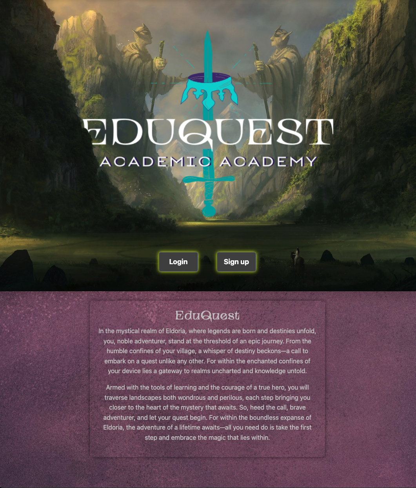

# EduQuest

Traditional education systems often lack engagement and fail to motivate students. There's a need for a platform that makes the learning experience more enjoyable and rewarding.

This apps goal is to gamify the learning experience and can significantly enhance student motivation and engagement. The aim is to revolutionise education by integrating RPG game mechanics to make the learning process more interactive and enjoyable.

# Getting Started

To start your adventure, click the link!

[Click here to vist our app](https://eduquest-team.fly.dev/)

# Screenshots

Explore the visual journey of EduQuest:

### ERD

### Wireframe

### Home Page v1

### Subject detail v1

### Dashboard v1

### v2

# Technologies Used

EduQuest is built using the following technologies:

- JavaScript
- HTML
- CSS
- Python
- Django
- Postgesql
- Bootstrap

# Planning

Check out our project planning board on Trello:

[Click to View Project Planning](https://trello.com/b/ElLEECsK/project-3-eduquest)

# Next Steps

- Future enhancement one: Implement a reward system where users can receive awards such as swords, avatars, equipment, etc., upon completing quests or achieving milestones.

- Future enhancement two: Develop a feature for users to create and customize their avatars, allowing for personalization and unique representations within the platform.

- Future enhancement three: Add more unique quests to the platform, providing users with diverse and engaging challenges to complete.

- Future enhancement four: Implement a notification system to alert users about upcoming events, keeping them engaged and informed.
  Future enhancement five: Incorporate a feature to display the percentage of users who have earned a specific quest + badge, providing users with a sense of achievement and comparison.

- Future enhancement six: Enable OAuth sign-up functionality to provide users with the option to register or log in using OAuth, enhancing accessibility and convenience.

- Future enhancement seven: Implement additional daily tasks to encourage consistent engagement and learning habits among users.
